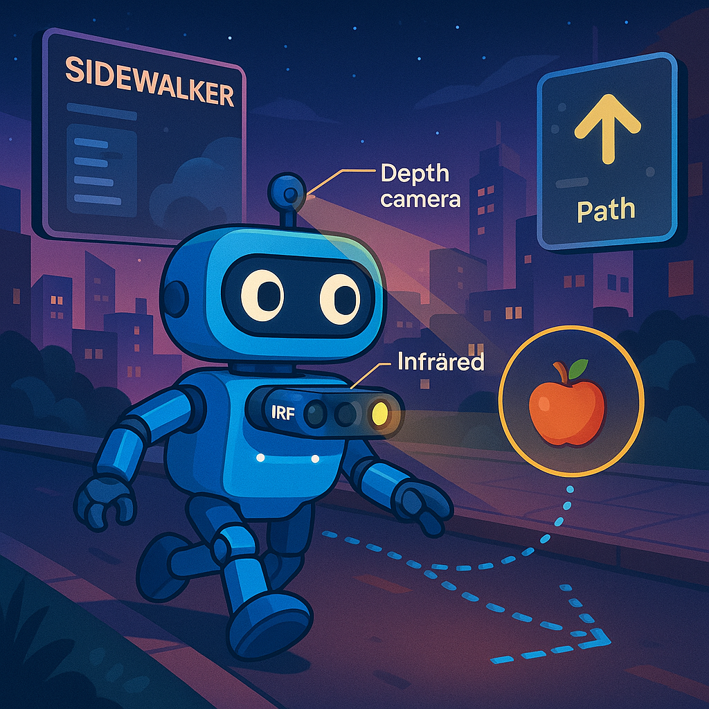

<!-- # SideWalker



Robot_navigation : based on Imitation Learning, Reinforcement Learning

We implement robot navigation environment using MetaUrban 

[MetaUrban Project](https://metadriverse.github.io/metaurban/)
 -->

<!-- # Installation  -->


# SideWalker


## Overview

**SideWalker** is a futuristic autonomous robot navigation project for urban sidewalks, powered by state-of-the-art Imitation Learning and Reinforcement Learning techniques.
We leverage realistic simulation environments using 
**MetaUrban** to train and validate robust navigation policies for wheeled or legged robots equipped with only cameras or depth sensors.


## Project Structure

```
sidewalker/
│
├── action/               
├── assets/              # Project logos, images, diagrams
├── env/                 # MetaUrban-based environment wrappers
├── model/               # RL/IL vision-based agent
├── obs/                 # Observation : Depth, RGB, Segment
├── Reward/                 
├── scripts/             # Training and evaluation scripts
├── utils/               # Utility functions, logging,eval
├── README.md
└── ...
```

## Quick Start

#### Train with single processor
```python
python3 -m scripts.core
```

#### Validation with Visualization
```python
python3 -m scripts.core_viz
```
<!-- 
## Quick Start

1. **Clone the repository**

   ```bash
   git clone https://github.com/your-username/sidewalker.git
   cd sidewalker
   ```

2. **Install dependencies**
   (Python 3.8+, MetaUrban, RL libraries)

   ```bash
   pip install -r requirements.txt
   ```

3. **Get started with MetaUrban**
   Visit the [MetaUrban Project](https://metadriverse.github.io/metaurban/)
   for setup and documentation.

4. **Train or evaluate SideWalker**

   ```bash
   python scripts/train.py --config configs/sidewalker.yaml
   ``` -->

## MetaUrban

This project uses [MetaUrban](https://metadriverse.github.io/metaurban/)
for simulating urban navigation environments with high fidelity and flexibility.

## Citation

If you use SideWalker or MetaUrban in your research, please consider citing MetaUrban:

```
@article{metaurban2024,
  title={MetaUrban: Scalable Urban Navigation Simulation for Autonomous Agents},
  author={Metadriverse Team},
  journal={Simulation & Modeling},
  year={2024}
}
```

